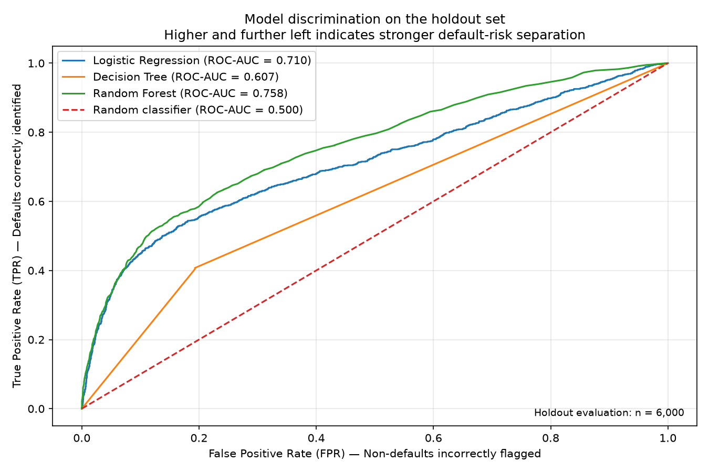
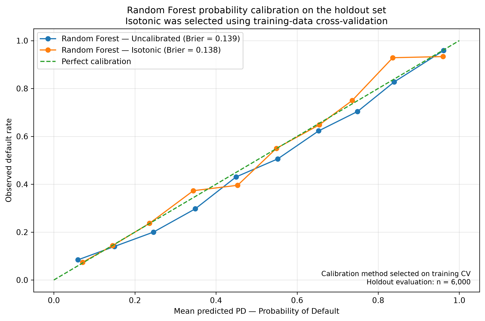
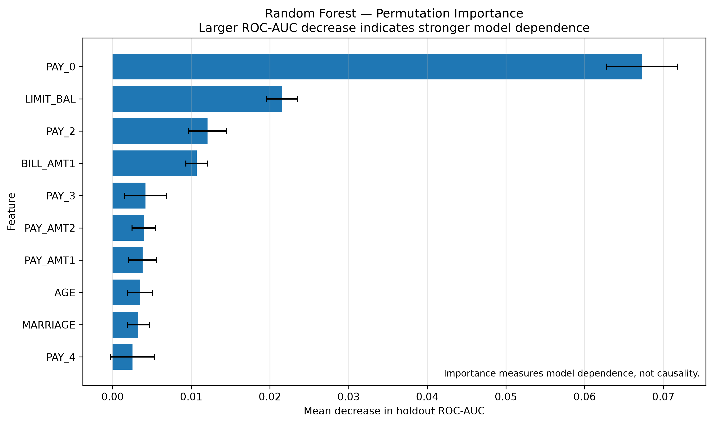

# 💳 Credit Risk Model Development Platform

**End-to-End-Modellierung von Kreditausfallrisiken — von Rohdaten über kalibrierte Ausfallwahrscheinlichkeiten bis zu Explainability, Experiment Tracking und automatisiertem Reporting.**

[](https://www.python.org/)
[](https://scikit-learn.org/)
[](https://mlflow.org/)
[](#tests-und-code-qualität)
[](https://docs.astral.sh/ruff/)
[](https://github.com/Umi156/credit-risk-platform/actions/workflows/ci.yml)

**Sprache:** 🇬🇧 [English](README.md) · 🇩🇪 [Deutsch](README_DE.md) · 🇮🇹 [Italiano](README_IT.md)

---

## 🎯 Projekt auf einen Blick

Dieses Portfolio-Projekt implementiert einen reproduzierbaren Machine-Learning-Workflow zur **Modellierung von Kreditausfallrisiken** auf Basis des UCI-Datensatzes *Default of Credit Card Clients*.

Das Projekt geht über reines Modelltraining hinaus und umfasst **Datenvalidierung, Cross-Validation, Wahrscheinlichkeitskalibrierung, Schwellenwertanalyse, Explainability, MLflow Experiment Tracking, automatisiertes Reporting, Softwaretests und Continuous Integration**.

> [!IMPORTANT]
> **Portfolio-Umfang:** Dieses Projekt demonstriert Konzepte der Kreditrisikomodellentwicklung und Software-Engineering-Praktiken. Es erhebt **keinen Anspruch auf regulatorische Konformität, IRBA-Konformität oder Produktionstauglichkeit**.

### Was dieses Projekt demonstriert

| Bereich | Umsetzung |
| --- | --- |
| 💳 **Kreditrisiko** | Modellierung von Ausfallrisiko / Ausfallwahrscheinlichkeit |
| 🧠 **Machine Learning** | Logistic Regression, Decision Tree, Random Forest |
| 📊 **Modellvalidierung** | Stratified 5-fold CV, ROC-AUC, AP, Brier Score, Log Loss |
| 🎯 **Kalibrierung** | Sigmoid- und isotone Wahrscheinlichkeitskalibrierung |
| ⚖️ **Entscheidungsanalyse** | Threshold-Trade-offs, Precision, Recall und False-Positive-Rate |
| 🔍 **Explainability** | Permutation Feature Importance |
| 🧪 **Experiment Tracking** | MLflow mit lokalem SQLite-Backend |
| 🛠️ **Engineering** | Python-Paketstruktur, pytest, Ruff, Git/GitHub, GitHub Actions |
| 📄 **Reporting** | Automatisierter Modellbericht und diagnostische Visualisierungen |

---

## 🏆 Ergebnisse auf einen Blick

### Ausgewähltes Modell — Isotonic-Calibrated Random Forest

| ROC-AUC ↑ | Average Precision ↑ | Brier Score ↓ | Log Loss ↓ |
| :---: | :---: | :---: | :---: |
| **0.7625** | **0.5425** | **0.1375** | **0.4381** |

Die Kalibrierungsmethode wurde mittels **Cross-Validation auf den Trainingsdaten** ausgewählt. Der Brier Score diente dabei als primäres Kalibrierungskriterium.

> [!NOTE]
> Der Holdout-Datensatz war bereits in früheren Phasen der Modellentwicklung untersucht worden. Die hier dargestellten Werte repräsentieren daher die aktuelle Portfolio-Evaluation und **keinen frischen, unabhängigen finalen Testdatensatz**.

---

## 🔄 End-to-End-Workflow

```text
                    UCI Credit Card Default Dataset
                                 │
                                 ▼
                         Data Ingestion
                                 │
                                 ▼
                         Data Validation
                                 │
                                 ▼
                          Preprocessing
                                 │
                                 ▼
                     Stratified Train / Holdout
                                 │
                                 ▼
                 5-Fold Cross-Validated Comparison
                        ┌────────┼────────┐
                        ▼        ▼        ▼
                     Logistic  Decision  Random
                    Regression   Tree    Forest
                                           │
                                           ▼
                                  Probability Calibration
                                    ┌──────┴──────┐
                                    ▼             ▼
                                Sigmoid       Isotonic
                                                   │
                                                   ▼
                                          Selected Model
                                                   │
                         ┌─────────────────────────┼─────────────────────┐
                         ▼                         ▼                     ▼
                 Threshold Analysis        Explainability        MLflow Tracking
                         │                         │                     │
                         └─────────────────────────┼─────────────────────┘
                                                   ▼
                                      Reporting & Automated Tests
                                                   │
                                                   ▼
                                      GitHub Actions CI
```

---

## 🛠️ Implementierte Funktionen

- Reproduzierbare Datenaufnahme des UCI-Quelldatensatzes
- Validierung von Datenschema und Datenqualität
- Preprocessing-Pipeline für Kreditrisikodaten
- Stratifizierte Aufteilung in Trainings- und Holdout-Daten
- Logistic-Regression-Baseline
- Decision-Tree-Modell
- Random-Forest-Modell
- Stratifizierte 5-fold Cross-Validation
- Evaluation mit ROC-AUC, Average Precision, Brier Score und Log Loss
- Analyse von Entscheidungsschwellenwerten
- Wahrscheinlichkeitskalibrierung mit Sigmoid und Isotonic Calibration
- Modell-Explainability mittels Permutation Importance
- ROC-, Precision-Recall-, Calibration-, Threshold- und Feature-Importance-Visualisierungen
- Automatisierter Markdown-Modellbericht
- MLflow Experiment Tracking mit lokalem SQLite-Backend
- MLflow-Modellserialisierung mit `skops`
- Automatisierte Testsuite mit 54 Tests
- Statische Code-Qualitätsprüfung mit Ruff
- Versionskontrolle mit Git/GitHub
- Continuous Integration mit GitHub Actions

---

## 🧠 Modellentwicklung

Drei Kandidatenmodelle werden miteinander verglichen:

| Modell | Mean CV ROC-AUC | Mean CV Average Precision |
| --- | ---: | ---: |
| **Random Forest** | **0.7674** | **0.5397** |
| Logistic Regression | 0.7272 | 0.5068 |
| Decision Tree | 0.6149 | 0.2908 |

Der Random Forest erzielte unter den untersuchten Kandidatenmodellen die stärkste Diskriminierungsleistung in der Cross-Validation.

### Wahrscheinlichkeitskalibrierung

Der Random Forest wurde anschließend mit Sigmoid- und Isotonic Calibration untersucht.

Die Auswahl der Kalibrierungsmethode erfolgte mittels Cross-Validation auf den Trainingsdaten, wobei der **Brier Score** als primäres Kalibrierungskriterium verwendet wurde.

| Methode | Mean CV ROC-AUC | Mean CV Brier Score | Mean CV Log Loss |
| --- | ---: | ---: | ---: |
| **Isotonic** | 0.7736 | **0.1355** | **0.4321** |
| Sigmoid | **0.7741** | 0.1357 | 0.4331 |
| Uncalibrated | 0.7674 | 0.1376 | 0.4405 |

Isotonic Calibration wurde ausgewählt, da sie den niedrigsten mittleren Brier Score in der Cross-Validation erzielte.

---

## 📊 Evaluation des ausgewählten Modells

Der ausgewählte Isotonic-Calibrated Random Forest erzielte:

| Metrik | Holdout-Ergebnis | Richtung |
| --- | ---: | :---: |
| ROC-AUC | **0.7625** | ↑ höher ist besser |
| Average Precision | **0.5425** | ↑ höher ist besser |
| Brier Score | **0.1375** | ↓ niedriger ist besser |
| Log Loss | **0.4381** | ↓ niedriger ist besser |

Die Ergebnisse zeigen eine moderate Diskriminierungsleistung sowie eine Verbesserung der Wahrscheinlichkeitsqualität gegenüber dem unkalibrierten Random Forest.

> [!CAUTION]
> **Methodische Einschränkung:** Die Kalibrierungsmethode wurde mittels Cross-Validation auf den Trainingsdaten ausgewählt. Der hier berichtete Holdout-Datensatz war bereits in früheren Phasen der Modellentwicklung untersucht worden und sollte daher nicht als frischer unabhängiger finaler Testdatensatz interpretiert werden.

---

## 📈 Modelldiagnostik

### ROC-Kurven

Die ROC-Kurven vergleichen die Ranking- bzw. Diskriminierungsleistung der untersuchten Kandidatenmodelle.



### Wahrscheinlichkeitskalibrierung

Die Kalibrierungsanalyse vergleicht vorhergesagte Ausfallwahrscheinlichkeiten mit beobachteten Ausfallhäufigkeiten.



### Modell-Explainability

Permutation Importance wird verwendet, um zu untersuchen, wie stark der trainierte Random Forest von einzelnen Eingangsmerkmalen abhängt.



---

## ⚖️ Threshold-Analyse

Das Projekt untersucht mehrere Wahrscheinlichkeitsschwellenwerte, anstatt automatisch davon auszugehen, dass `0.5` angemessen ist.

Dadurch werden insbesondere die Trade-offs zwischen folgenden Größen sichtbar:

- **False Negatives** — Ausfallrisikofälle, die vom Modell nicht als riskant erkannt werden
- **False Positives** — Nicht-Ausfallfälle, die als riskant eingestuft werden
- **Recall**
- **Precision**
- **False-Positive-Rate**

Es wird kein geschäftlich optimaler Threshold behauptet, da der UCI-Datensatz nicht die dafür erforderlichen wirtschaftlichen Kostenannahmen enthält.

---

## 🔍 Explainability

Permutation Importance wird verwendet, um zu untersuchen, wie stark der trainierte Random Forest von einzelnen Eingangsmerkmalen abhängt.

Die stärksten beobachteten Modellabhängigkeiten umfassen:

| Rang | Feature |
| ---: | --- |
| 1 | `PAY_0` |
| 2 | `LIMIT_BAL` |
| 3 | `PAY_2` |
| 4 | `BILL_AMT1` |
| 5 | `PAY_3` |

> [!NOTE]
> Permutation Importance misst **Modellabhängigkeit, nicht Kausalität**. Korrelierte Prädiktoren können die gemessene Importance außerdem auf mehrere Features verteilen oder abschwächen.

---

## 🧪 Experiment Tracking

MLflow wird für das Tracking des ausgewählten Modellexperiments verwendet.

Das aktuelle lokale Setup erfasst:

- Modellparameter
- ROC-AUC
- Average Precision
- Brier Score
- Log Loss
- serialisiertes scikit-learn-Modellartefakt
- MLflow-Umgebungs- und Modellmetadaten

Die Tracking-Metadaten werden in einem lokalen **SQLite-Backend** gespeichert.

Lokale MLflow-Datenbanken und generierte Tracking-Artefakte sind von der Git-Versionskontrolle ausgeschlossen.

---

## 📦 Datensatz

Das Projekt verwendet den Datensatz **UCI Machine Learning Repository — Default of Credit Card Clients**.

| Eigenschaft | Wert |
| --- | --- |
| Beobachtungen | 30.000 |
| Target | Binärer Ausfallindikator |
| Kreditinformationen | Kreditlimit |
| Zahlungsverhalten | Payment-Status-Historie |
| Finanzhistorie | Rechnungsbeträge und vorherige Zahlungen |
| Weitere Merkmale | Demografische Variablen |

**Datensatzquelle:**

https://archive.ics.uci.edu/dataset/350/default+of+credit+card+clients

**DOI:**

https://doi.org/10.24432/C55S3H

Der Datensatz wird unter der **CC BY 4.0**-Lizenz bereitgestellt.

### Einschränkungen des Datensatzes

Der Datensatz ist historisch und repräsentiert keine aktuellen europäischen Bankportfolios.

Er enthält nicht die vollständigen Informationen, die für produktives Kreditrisikomanagement oder regulatorische Modellentwicklung erforderlich wären.

Dieses Projekt erhebt daher **keinen Anspruch auf**:

- IRBA-Konformität
- regulatorische Modellvalidierung
- Produktionstauglichkeit
- Repräsentation aktueller europäischer Kreditportfolios

---

## ⚙️ Technologie-Stack

### Implementiert

| Kategorie | Technologien |
| --- | --- |
| Programmiersprache | Python 3.12 |
| Datenverarbeitung | Pandas, NumPy |
| Machine Learning | scikit-learn |
| Visualisierung | Matplotlib, Seaborn |
| Experiment Tracking | MLflow |
| Tracking-Backend | SQLite |
| Testing | pytest |
| Code-Qualität | Ruff |
| Versionskontrolle | Git, GitHub |
| Continuous Integration | GitHub Actions |

### Geplante Plattformerweiterungen

Die folgenden Komponenten sind geplante Erweiterungen und **noch nicht als fertiggestellte Funktionalität implementiert**:

- PostgreSQL für persistente Plattform-Datenspeicherung
- Apache Airflow für Workflow-Orchestrierung
- Docker / Docker Compose für reproduzierbare Services

---

## 📁 Projektstruktur

```text
credit-risk-platform/
├── .github/
│   └── workflows/
│       └── ci.yml
├── config/
├── data/
│   ├── raw/
│   └── processed/
├── docker/
├── notebooks/
├── reports/
│   └── figures/
├── src/
│   └── credit_risk_platform/
├── tests/
├── README.md
├── README_DE.md
├── README_IT.md
├── pyproject.toml
└── .gitignore
```

---

## ✅ Tests und Code-Qualität

Die aktuelle automatisierte Testsuite enthält **54 Tests** für zentrale Komponenten, darunter:

- Preprocessing
- Modeling
- Evaluation
- Threshold Analysis
- Calibration
- Explainability
- Visualization
- Reporting
- MLflow Experiment Tracking

Aktuell verifizierte Quality Gates:

```text
Lokal:
54 passed
Ruff: All checks passed

GitHub Actions CI:
success
```

Der GitHub-Actions-Workflow reproduziert das Quality Gate auf einem frischen Ubuntu-Runner mit Python 3.12. Dabei werden die Projektabhängigkeiten installiert, der UCI-Quelldatensatz abgerufen sowie Ruff und die automatisierte pytest-Testsuite ausgeführt.

---

## 🔁 Reproduzierbarkeit

Die Projektabhängigkeiten sind in `pyproject.toml` definiert.

Das Projekt verwendet derzeit:

```text
Python >=3.12,<3.13
```

Der lokale Entwicklungsworkflow verwendet eine isolierte Python Virtual Environment.

Continuous Integration wird auf einem frischen Ubuntu-GitHub-Actions-Runner mit Python 3.12 ausgeführt.

Eine vollständig containerisierte Umgebung wurde noch nicht implementiert. Docker-basierte Reproduzierbarkeit bleibt Teil der geplanten Plattformerweiterung.

---

## 🗺️ Roadmap

- [x] Data Ingestion
- [x] Data Validation
- [x] Preprocessing
- [x] Baseline- und Kandidatenmodelle
- [x] Cross-Validation
- [x] Holdout-Evaluation
- [x] Threshold Analysis
- [x] Explainability
- [x] Probability Calibration
- [x] Automatisiertes Reporting
- [x] MLflow Experiment Tracking
- [x] Automatisierte Tests
- [x] GitHub Actions CI
- [ ] PostgreSQL-Persistenz
- [ ] Apache-Airflow-Orchestrierung
- [ ] Docker-Compose-Umgebung

---

## ⚠️ Disclaimer

Dieses Repository ist eine Lern- und Portfolio-Implementierung, die sich an professionellen Workflows der Kreditrisikomodellentwicklung orientiert.

Die hier dargestellten Modelle, Validierungsverfahren, Daten und die Softwarearchitektur sind **nicht ausreichend, um regulatorische Konformität, IRBA-Konformität oder Produktionstauglichkeit nachzuweisen**.