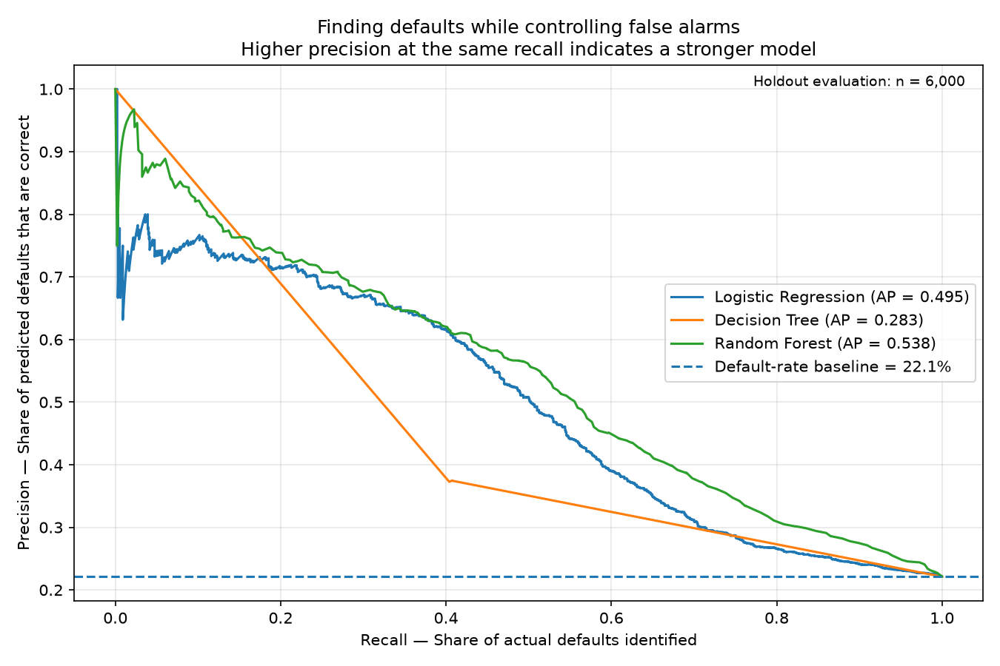
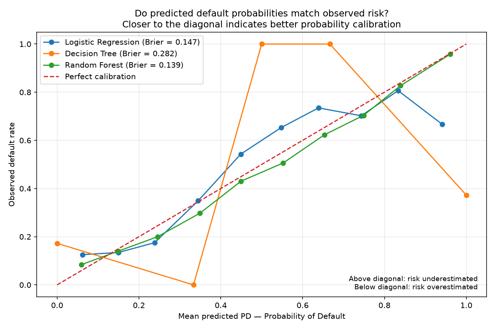
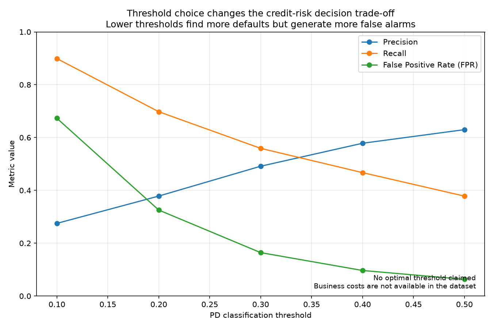

# Credit Risk Model Evaluation Report

## Executive Summary / Zusammenfassung

### FACT / FAKT

Cross-validation identified **Random Forest** as the leading candidate by
mean ROC-AUC.

On the holdout set of **6,000 observations**,
**Random Forest** remained the strongest candidate by ROC-AUC,
achieving:

- **ROC-AUC:** 0.758
- **Average Precision (AP):** 0.538
- **Brier Score:** 0.139

Die Cross-Validation identifizierte **Random Forest** anhand der mittleren
ROC-AUC als führenden Kandidaten.

Auf dem Holdout-Datensatz mit **6.000 Beobachtungen** blieb
**Random Forest** gemessen an der ROC-AUC der stärkste Kandidat mit:

- **ROC-AUC:** 0.758
- **Average Precision (AP):** 0.538
- **Brier Score:** 0.139

## Cross-Validation Results / Cross-Validation-Ergebnisse

| model | mean_roc_auc | std_roc_auc | mean_average_precision | mean_brier_score | mean_log_loss |
| --- | --- | --- | --- | --- | --- |
| random_forest | 0.7674 | 0.0052 | 0.5397 | 0.1376 | 0.4405 |
| logistic_regression | 0.7272 | 0.0115 | 0.5068 | 0.1444 | 0.4646 |
| decision_tree | 0.6149 | 0.0095 | 0.2908 | 0.2746 | 9.8900 |

Cross-validation is performed on the training partition and estimates how
consistently the candidate models generalize across different training folds.

Die Cross-Validation wird auf dem Trainingsdatensatz durchgeführt und schätzt,
wie konsistent die Kandidatenmodelle über unterschiedliche Trainings-Folds
generalisieren.

## Holdout Evaluation / Holdout-Evaluation

| model | roc_auc | average_precision | brier_score | log_loss |
| --- | --- | --- | --- | --- |
| random_forest | 0.7583 | 0.5379 | 0.1391 | 0.4493 |
| logistic_regression | 0.7100 | 0.4950 | 0.1466 | 0.4703 |
| decision_tree | 0.6068 | 0.2830 | 0.2816 | 10.1409 |

The holdout set is used for model evaluation and was not used to fit the
candidate models.

Der Holdout-Datensatz wird zur Modellevaluation verwendet und wurde nicht zum
Fitten der Kandidatenmodelle genutzt.

## Threshold Analysis / Schwellenwertanalyse — Random Forest

| threshold | true_negatives | false_positives | false_negatives | true_positives | precision | recall | false_positive_rate |
| --- | --- | --- | --- | --- | --- | --- | --- |
| 10.0% | 1,528 | 3,145 | 134 | 1,193 | 27.5% | 89.9% | 67.3% |
| 20.0% | 3,152 | 1,521 | 401 | 926 | 37.8% | 69.8% | 32.5% |
| 30.0% | 3,905 | 768 | 585 | 742 | 49.1% | 55.9% | 16.4% |
| 40.0% | 4,221 | 452 | 707 | 620 | 57.8% | 46.7% | 9.7% |
| 50.0% | 4,378 | 295 | 825 | 502 | 63.0% | 37.8% | 6.3% |

### INTERPRETATION / INTERPRETATION

A lower Probability of Default (PD) classification threshold identifies more
actual defaults and therefore increases Recall, but it also produces more
false-positive risk flags.

Ein niedrigerer Klassifikations-Schwellenwert für die Probability of Default
(PD / Ausfallwahrscheinlichkeit) erkennt mehr tatsächliche Defaults und erhöht
dadurch den Recall, erzeugt jedoch auch mehr False-Positive-Risk-Flags.

A higher threshold is more selective. In the observed threshold analysis,
Precision increases while Recall and the False Positive Rate decrease.

Ein höherer Schwellenwert ist selektiver. In der beobachteten
Schwellenwertanalyse steigt die Precision, während Recall und False Positive
Rate sinken.

### LIMITATION / EINSCHRÄNKUNG

This analysis does **not** claim a business-optimal classification threshold.

The dataset does not provide the real economic costs required to quantify the
trade-off between missed defaults and false-positive risk flags.

Diese Analyse beansprucht **keinen wirtschaftlich optimalen
Klassifikations-Schwellenwert**.

Der Datensatz enthält nicht die realen ökonomischen Kosten, die erforderlich
wären, um den Trade-off zwischen übersehenen Defaults und
False-Positive-Risk-Flags zu quantifizieren.

## Probability Calibration / Wahrscheinlichkeitskalibrierung

Calibration evaluates whether predicted default probabilities correspond to
the default rates actually observed among cases with comparable predicted
probabilities.

Die Kalibrierung bewertet, ob prognostizierte Ausfallwahrscheinlichkeiten den
tatsächlich beobachteten Default-Raten bei Fällen mit vergleichbaren
prognostizierten Wahrscheinlichkeiten entsprechen.

The Brier Score measures the mean squared error of predicted probabilities.
Lower Brier Scores indicate lower probability error. Calibration should also
be inspected graphically because a single summary metric cannot show where
probability estimates deviate from observed default rates.

Der Brier Score misst den mittleren quadratischen Fehler der prognostizierten
Wahrscheinlichkeiten. Niedrigere Brier Scores bedeuten einen geringeren
Wahrscheinlichkeitsfehler. Die Kalibrierung sollte zusätzlich grafisch
untersucht werden, da eine einzelne Kennzahl nicht zeigt, in welchen
Wahrscheinlichkeitsbereichen die Prognosen von den beobachteten Default-Raten
abweichen.

## Model Evaluation Figures / Grafiken zur Modellbewertung

### ROC — Discrimination / Trennschärfe

### Precision-Recall — Default Detection

### Probability Calibration / Wahrscheinlichkeitskalibrierung

### Threshold Trade-off / Schwellenwert-Trade-off

## Methodological Conclusion / Methodisches Fazit

### FACT / FAKT

The report compares Logistic Regression, Decision Tree and Random Forest using
the same data split and evaluation framework.

Der Report vergleicht Logistic Regression, Decision Tree und Random Forest mit
demselben Daten-Split und Evaluationsrahmen.

### INTERPRETATION / INTERPRETATION

The current results favor Random Forest among the three evaluated candidate
models. Model quality is assessed from multiple perspectives rather than from
a single classification metric:

- discrimination,
- Precision-Recall performance,
- probability error,
- calibration,
- and threshold behavior.

Die aktuellen Ergebnisse sprechen unter den drei untersuchten
Kandidatenmodellen für Random Forest. Die Modellqualität wird aus mehreren
Perspektiven und nicht anhand einer einzigen Klassifikationsmetrik bewertet:

- Trennschärfe,
- Precision-Recall-Leistung,
- Wahrscheinlichkeitsfehler,
- Kalibrierung
- und Schwellenwertverhalten.

### LIMITATION / EINSCHRÄNKUNG

The holdout results have now been inspected and are therefore part of the
evaluation evidence. They should not subsequently be used for iterative model
tuning or threshold optimization.

Die Holdout-Ergebnisse wurden inzwischen betrachtet und sind damit Teil der
Evaluation. Sie sollten anschließend nicht für iterative Modelloptimierung
oder Threshold-Optimierung verwendet werden.

This portfolio project demonstrates a credit-risk model-development workflow.
It does not claim that the dataset, model or resulting workflow is
IRBA-compliant or suitable for production credit decisions.

Dieses Portfolio-Projekt demonstriert einen Workflow zur Entwicklung eines
Kreditrisikomodells. Es wird nicht behauptet, dass Datensatz, Modell oder
resultierender Workflow IRBA-konform oder für produktive Kreditentscheidungen
geeignet sind.
